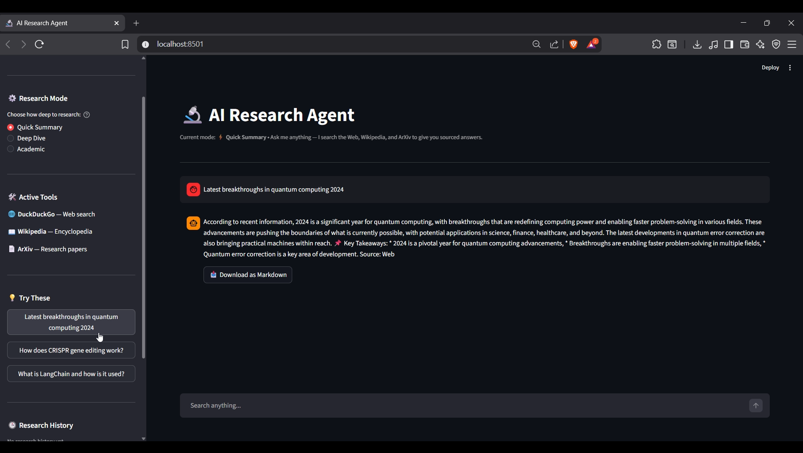

# 🔬 AI Research Agent

An intelligent multi-source research assistant that searches the Web, Wikipedia, and ArXiv papers to give you structured, sourced answers — with conversation memory.

---

## ✨ Features

| Feature | Details |
|---|---|
| 🌐 **Multi-source search** | Web (DuckDuckGo), Wikipedia, ArXiv papers |
| 🔎 **Source transparency** | See exactly which tools were used and URLs found |
| 📥 **Export to Markdown** | Download any answer as a formatted report |
| ⚙️ **3 Research modes** | Quick Summary / Deep Dive / Academic |
| 🕒 **Research history** | All sessions saved to SQLite, reload anytime |
| 🧠 **Conversation memory** | Follow-up questions work naturally |
| ⚡ **Powered by Groq** | LLaMA 3.3 70B — fast and free inference |

---

## 🔬 Research Modes

**⚡ Quick Summary** — 2-3 paragraphs + key takeaways bullet list. Best for fast answers.

**🔍 Deep Dive** — Full structured report with Overview, Key Details, Recent Developments, and Summary sections. Best for thorough understanding.

**🎓 Academic** — ArXiv-first, cites paper titles and authors, distinguishes established vs preliminary research. Best for scientific topics.

---

## 🛠️ Tech Stack

- **LangChain** — Agent orchestration, tool use, memory
- **Groq + LLaMA 3.3 70B** — Fast, free LLM inference
- **Streamlit** — Web UI
- **SQLite** — Local history persistence
- **DuckDuckGo / Wikipedia / ArXiv** — Free data sources

---

## 📸 Screenshots

---

Built by [Haya Mohamed]
